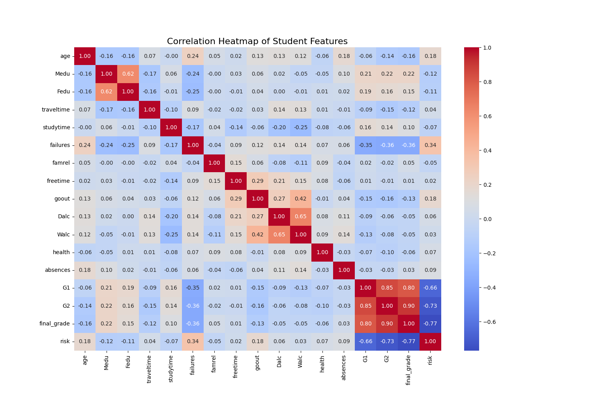
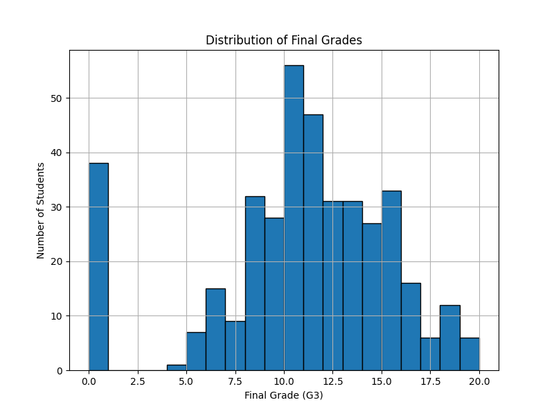
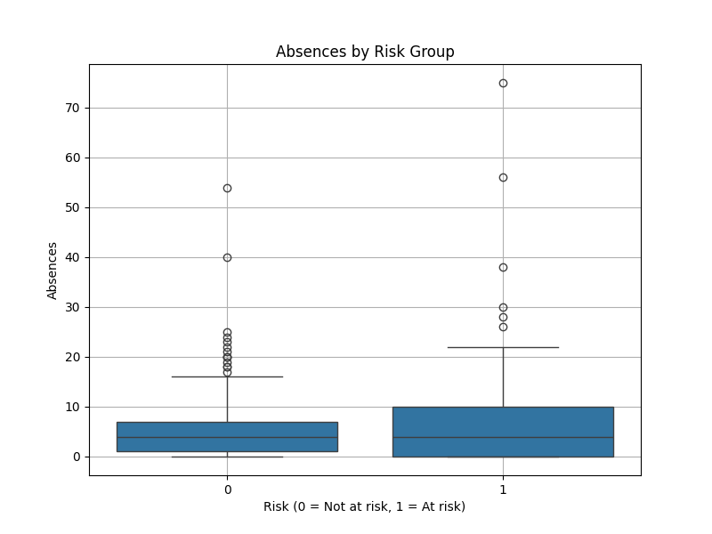
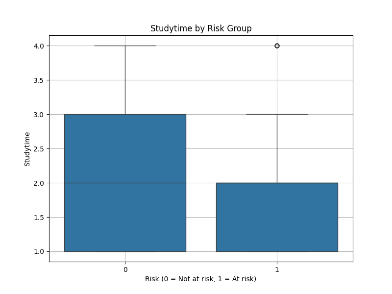
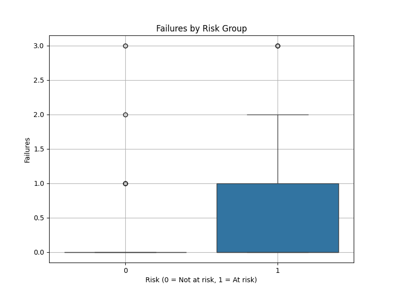

# 🧠 Smart Student Performance Analyzer

An intelligent system for analyzing and predicting student performance using Python, machine learning, and SQLite.

---

## 📊 What It Does

- Loads and stores student data in a SQLite database
- Analyzes student performance (grades, absences, failures, etc.)
- Predicts:
  - 🎯 Final grade (using regression)
  - ⚠️ Risk of failure (using classification)
- Visualizes trends and correlations
- Saves model predictions into a database
- Provides a command-line interface (CLI) for users

---

## 💻 Technologies Used

- **Python 3.10**
- **pandas**, **NumPy**
- **scikit-learn** — Logistic & Linear Regression
- **matplotlib**, **seaborn** — Data visualization
- **SQLite3** — Lightweight database
- **CLI** (Terminal-based interface)

---

## 📁 Project Structure

<pre>
Student_analyzer/
├── data/
│   └── student_performance.db            # SQLite database
│
├── plots/                                # Saved visualizations
│   ├── heatmap.png
│   ├── final_grade_hist.png
│   ├── absences_by_risk.png
│   ├── studytime_by_risk.png
│   └── failures_by_risk.png
│
├── notebooks/
│   └── SmartStudentAnalysis.ipynb        # Google Colab notebook version
│
├── student_analyzer.py                   # Main CLI application
├── requirements.txt                      # Python dependencies
└── README.md                             # Project documentation
</pre>

---

## 📈 Sample Outputs

### 🔥 Correlation Heatmap


### 🎯 Final Grade Distribution


### 📦 Absences by Risk


### 📚 Study Time by Risk


### 🚫 Failures by Risk

---

## ▶️ How to Run

1. **Clone this repository**:
```bash
git clone https://github.com/Pashokkkk/student-analyzer.git
cd student-analyzer

pip install -r requirements.txt

python student_analyzer.py 
```


## 🧪 Sample SQL Reports

### 📌 At-risk Students
```sql
SELECT * 
FROM students_predictions 
WHERE predicted_risk = 1;
```
### 📌 Students Predicted to Fail (Final Grade < 10)
```sql
SELECT * 
FROM students_predictions 
WHERE predicted_final_grade < 10;
```
### 📌 High-Absence Risky Students
```sql
SELECT * 
FROM students_predictions 
WHERE predicted_risk = 1 
  AND absences > 10;
```
## 📌 Author

**Khomliuk Pavlo**  
[GitHub](https://github.com/Pashokkkk)  
[LinkedIn](https://www.linkedin.com/in/pavlo-khomliuk-234799251/)
